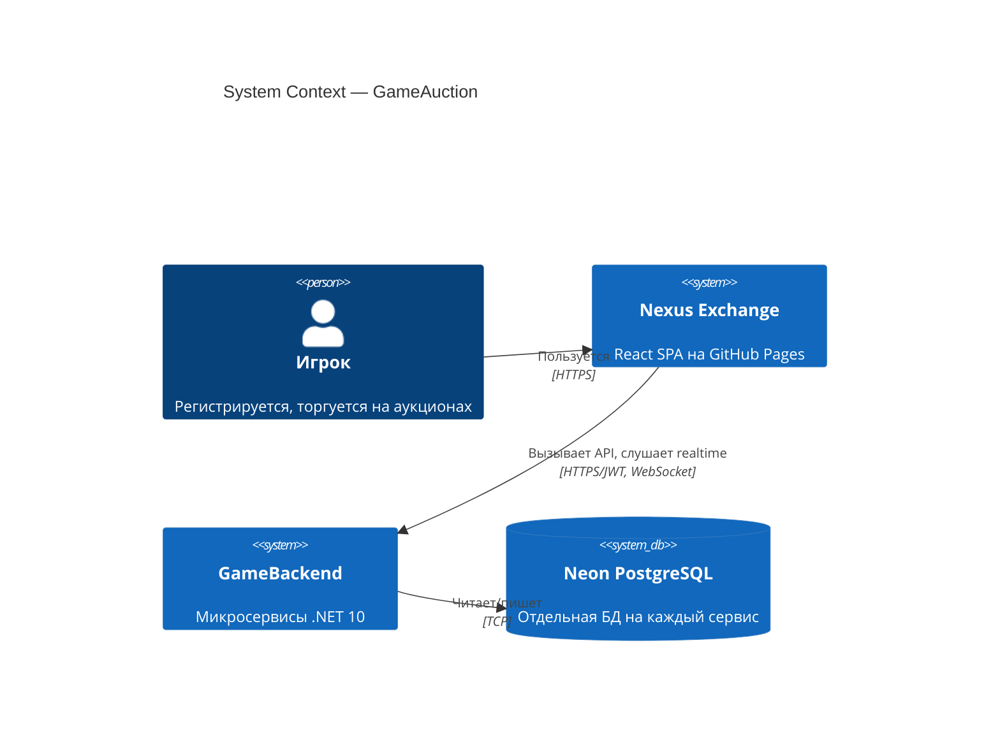
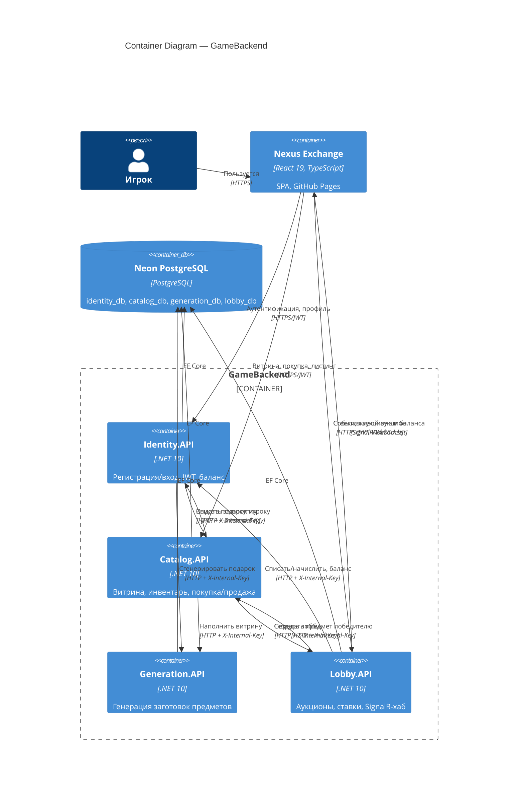

# Архитектура GameAuction

Диаграммы в нотации [C4](https://c4model.com/). Рендерятся на GitHub через Mermaid.

## Уровень 1 — System Context

## Уровень 2 — Containers

## Ключевые решения

Причины неочевидных архитектурных выборов зафиксированы в ADR — см. [`docs/adr/`](adr/):

- [0001](adr/0001-ensurecreated-over-ef-migrations.md) — `EnsureCreated` + идемпотентные патчи вместо EF Migrations
- [0002](adr/0002-internal-key-service-auth.md) — `X-Internal-Key` для межсервисной аутентификации
- [0003](adr/0003-in-memory-events-no-outbox.md) — доменные события через SignalR, без очереди и outbox
- [0004](adr/0004-signalr-balance-push.md) — пуш баланса по SignalR вместо опроса
